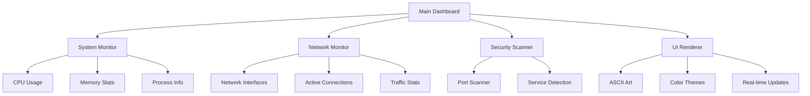

# Interactive Security Dashboard - Kalizzer

## Overview

A terminal-based security dashboard that displays real-time system information, network statistics, and security metrics in a visually appealing red team/cybersecurity style. Built with Python for maximum portability and GitHub resume appeal.

## Architecture



## Implementation Plan

### Core Components

1. **Main Dashboard (`index.py`)**

   - Entry point with menu system
   - Real-time refresh loop
   - Keyboard controls (q to quit, r to refresh)
   - Terminal clearing and cursor management

2. **System Monitor Module (`modules/system_monitor.py`)**

   - CPU usage percentage
   - Memory usage (used/total/percentage)
   - Disk usage statistics
   - Running processes count
   - System uptime

3. **Network Monitor Module (`modules/network_monitor.py`)**

   - Network interface list with IP addresses
   - Active network connections
   - Bytes sent/received per interface
   - Connection states (ESTABLISHED, LISTEN, etc.)

4. **UI Renderer (`modules/ui_renderer.py`)**

   - ASCII art banner/logo
   - Color schemes (red team theme)
   - Progress bars for metrics
   - Formatted tables and sections
   - Terminal size detection

5. **Configuration (`config.py`)**

   - Refresh interval settings
   - Color theme options
   - Display preferences

### Features

- **Real-time Updates**: Dashboard refreshes every 1-2 seconds
- **Color-coded Metrics**: Green (normal), Yellow (warning), Red (critical)
- **ASCII Art Banner**: Cybersecurity-themed logo
- **Modular Design**: Easy to add new monitoring modules
- **Cross-platform**: Works on Linux, macOS, Windows
- **Clean Exit**: Proper terminal cleanup on quit

### Dependencies

- `psutil` - System and process utilities
- `colorama` - Cross-platform colored terminal text
- Standard library: `os`, `sys`, `time`, `socket`, `subprocess`

### File Structure

```
Kalizzer/
├── index.py                 # Main entry point
├── config.py                # Configuration settings
├── requirements.txt         # Dependencies
├── README.md                # Project documentation
└── modules/
    ├── __init__.py
    ├── system_monitor.py    # System metrics collection
    ├── network_monitor.py   # Network statistics
    └── ui_renderer.py       # Terminal UI rendering
```

### Future Expansion Points

- Port scanner integration
- Vulnerability scanner
- Log file monitoring
- Alert system for anomalies
- Export functionality (JSON/CSV)
- Customizable widgets
- Plugin system for third-party modules

## Implementation Details

### Key Functions

**Main Loop (`index.py`)**:

- Initialize terminal
- Load configuration
- Enter refresh loop
- Handle keyboard input
- Clean exit

**System Monitor**:

- Use `psutil` for CPU, memory, disk stats
- Format data for display
- Calculate percentages and trends

**Network Monitor**:

- Enumerate network interfaces
- Get active connections via `psutil.net_connections()`
- Calculate network I/O statistics

**UI Renderer**:

- Generate ASCII banner with project name
- Create bordered sections for each metric
- Render progress bars for percentages
- Apply color coding based on thresholds

### Visual Design

- **Banner**: Large ASCII "KALIZZER" or security-themed logo
- **Layout**: Multi-column sections for different metrics
- **Colors**: 
  - Red/Orange for headers and critical alerts
  - Green for normal operations
  - Yellow for warnings
  - Cyan for network info
- **Progress Bars**: Visual representation of CPU/memory usage

### Error Handling

- Graceful degradation if modules fail
- Permission error handling for system access
- Terminal compatibility checks
- Network interface fallbacks